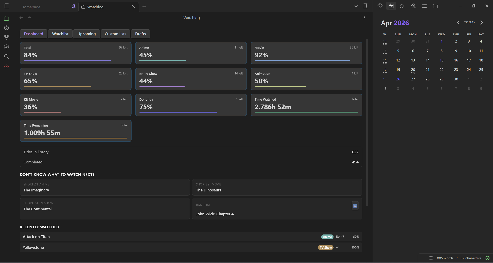
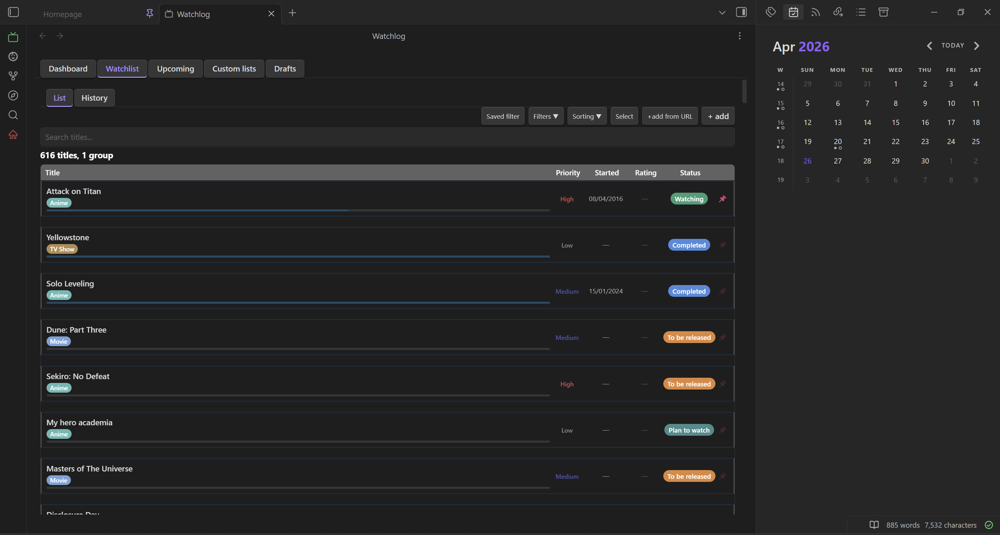
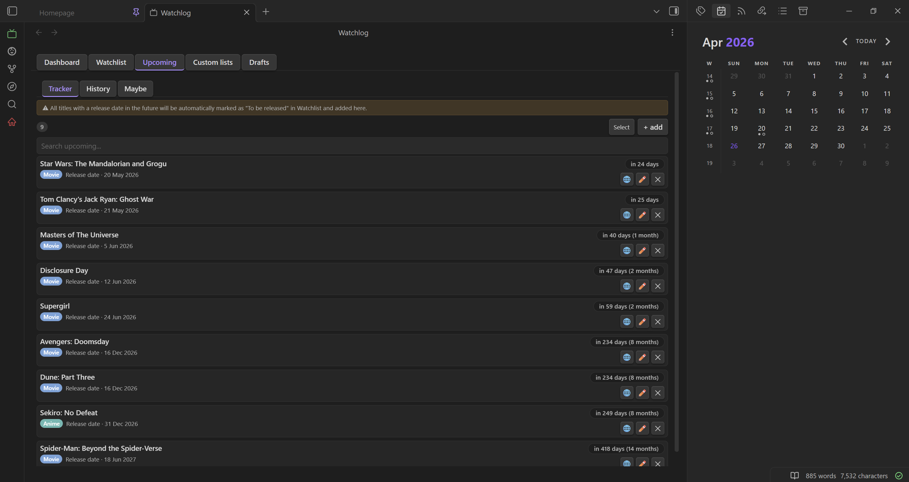
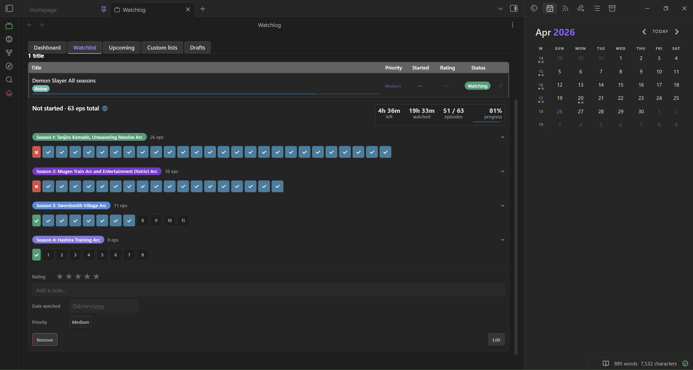

# WatchLog

Track your anime, movies, TV shows, books, and manga directly inside Obsidian — with episode tracking, progress stats, upcoming release alerts, community ratings, poster/cover art, and embeddable widgets.

## Features

### Watchlist
- **Two views** — switch between a **List** sub-tab (rows with expandable episode/season UI) and a **Cards** sub-tab (responsive poster-card grid with lazy-loaded cover art and a ⋮ menu for Edit / Refresh poster). Cards is the default view.
- **Full title management** — add, edit, and delete titles with fields for type, status, priority, rating (0–5 stars), notes, episode count, episode duration, release date, and an external link.
- **Episode tracking** — mark individual episodes as watched; seasons are shown as collapsible groups with per-season progress bars.
- **Skip episodes** — mark fillers, recaps, or other episodes as skippable per season (syntax `Season 1: 48 (33-37,42)`). Skipped episodes show a purple border and a dash (—), cycle through skipped → watched → empty on click, and are excluded from progress totals. Season headers and the Edit modal display skip counts (e.g. "X to skip · Y to watch").
- **Community ratings** — show IMDb, MyAnimeList, AniList, or TMDB scores (with vote counts) alongside your personal star rating. Manual ⟳ refresh, plus automatic background refresh when data is missing or over 30 days stale.
- **Groups** — bundle related titles (a film and its sequel, an anime and its movie) into a single collapsible row. Group rating, status, and progress are computed automatically from members.
- **Inline status change** — change a title's status from a colored dropdown directly on the expanded row or in the detail modal, without opening the Edit dialog.
- **Pinning** — pin a title or group so it appears in "Now Watching" widgets across your vault.
- **Sorting** — two-level sort (primary + secondary) across eleven keys: date added, title, status, type, rating, priority, episode duration, progress, remaining episodes, date modified, and random.
- **Filtering** — exclude by type, status, priority, rating, or group; show only groups; show only unrated or unprioritized titles; show only recently released titles (past 7 days). Each filter section has an "All" toggle to select/deselect everything at once. Save and restore named filter presets.
- **Fuzzy search** — instant search across all title names.
- **Selection mode** — select multiple titles or groups for batch delete or CSV export.

### Dashboard
- Per-type progress rings or rectangular cards (Anime, Movie, TV Show, etc.), plus dedicated **Books** and **Manga** cards fed from the Reading tab (pages/chapters/volumes read of total).
- A unified card combining **Total**, **Time watched**, and **Time remaining** in three equal segments, computed from episode counts and durations.
- Library summary: total titles and completed count.
- Suggestions panel: shortest unwatched title per type, with a random-pick button.
- Recently watched and recently added sections (last 3 each).

### Upcoming Releases
- **Tracker** — schedule releases with recurrence (once, daily, weekly, monthly), optional air time (HH:MM), and automatic countdown labels ("Today", "Tomorrow", "in N days").
- **Auto-status** — any title added with a future release date is automatically marked "To be released" and added to the Tracker.
- **Tick button** — mark the current episode as watched and advance the countdown in one click.
- **Notifications** — desktop notifications fire at the scheduled air time (checked every 60 seconds).
- **Reading items** — books and manga from the Reading tab can be scheduled too via the "+ add" finder, shown with Book/Manga badges. A dedicated reading schedule modal tracks chapters and volumes (a single date when there is no total).
- **Log sub-tab** — shows releases from the past 6 months with relative timestamps.
- **Maybe sub-tab** — holds titles you are considering for the Tracker; add them when you are ready.
- **Status bar count** — an optional "N due" indicator with the plugin icon appears in the status bar (hidden when zero); clicking it opens the Upcoming tab.

### Reading
A separate tracker for books and manga, fully independent from the Watchlist and stored in its own `reading.json`.
- **Books and Manga sub-tabs** — Books track pages and chapters; Manga track chapters and volumes. Each has its own status set (Reading, Completed, Plan to Read, On Hold, Dropped).
- **Card grid** — responsive grid of cover cards (Open Library covers for books, Jikan images for manga, or a colored fallback) with status dots, progress bars, and author. ⋮ menu to refresh the cover.
- **Detail modal** — cover, title, author, status badge, rating, progress editing, an Open-note button, and vault-page controls.
- **Favorite Quotes** — a Quotes section in the detail modal, parsed from the `## Quotes` section of each item's note file and rendered as callout blocks with page/chapter references; add quotes inline.
- **Custom fields** — per-sub-tab user-defined columns (text, number, select) with a per-column color picker and Fill or Border display styles, editable inline in the detail modal and managed via a Manage Columns modal.
- **API-assisted add** — Open Library search for books, Jikan search (or MAL-ID lookup) for manga, auto-filling title, author, page/chapter/volume counts, and cover; plus a release date field with optional API import.
- **Note files** — auto-generated Markdown at `WatchLog/Reading/Books/[Title].md` or `WatchLog/Reading/Manga/[Title].md` with YAML frontmatter and `## Notes` + `## Quotes` sections, kept in sync on edit.
- **Fuzzy search, filtering, sorting, and selection mode** — including saved filter presets and batch delete / batch status change.

### Drafts
- Monitors your entire vault for a configurable tag (default `#watchlog`).
- Extracts title names following the tag — supports comma-separated lists on the same line.
- Shows pending titles (not yet in Watchlist), already-added titles (dimmed), and dismissed titles.
- One-click "Add" opens a choice modal — add to Watchlist, add as a book, or add as manga — each opening the correct dialog with the draft text pre-filled.

### Log
- A standalone tab with a unified activity timeline for both Watchlist and Reading events.
- Vertical timeline with colored dots and connector lines, grouped by day with date headers.
- Action color coding: green (Completed/Watched), blue (Added), red (Deleted), amber (Status/Rating changed).
- Source filter toolbar: All / Watchlist / Reading. Holds up to 1 000 entries.

### Custom Lists
- Create freeform tables stored as Markdown files in your vault.
- Define custom columns with type (text, number, select), optional bold/italic formatting, and a lock flag to prevent accidental deletion.
- Edit cells inline (on both desktop and mobile); drag to reorder columns.
- **Auto-populate Time column** — any number column can pull remaining watch time (in minutes) from a Watchlist title with an exact name match. Enable via the ⏱ toggle in Edit Columns; values are cached and re-fetched on demand via the ↻ refresh icon in the column header.
- Name-cell autocomplete searches both Watchlist and Reading items.
- Each list has a Notes section rendered as Markdown.
- Pre-configure default columns in settings to apply to every new list.

### Inline Widgets
Embed live plugin data anywhere in your vault using fenced code blocks:

| Widget | What it shows |
|--------|--------------|
| `wl-todo` | Full progress card for a specific title — status, progress bar, next episode checkbox |
| `wl-todo:mini` | Compact single-line version of the above |
| `wl-stat:watched` | Total time watched (all Watching + Completed titles) |
| `wl-stat:remaining` | Total time remaining (Plan to watch + Watching) |
| `wl-stat:completed` | Count of Completed titles |
| `wl-stat:time` | Time watched + time remaining in one card |
| `wl-stat:time completed full` | Wide triple card: Time Watched · Time Remaining · Completed |
| `wl-upcoming:next` | Next upcoming title with name, type, release date, and countdown |
| `wl-nowwatching` | Currently pinned title with name, type badge, and progress bar |
| `wl-now-next` | Wide dual card: Now Watching · Up Next |

Widget state syncs bidirectionally with the Watchlist when the sync setting is enabled.

### Note File Generation
- Each title automatically gets a Markdown file in `WatchLog/[Type]/[Title].md` with YAML frontmatter (title, type, status, priority, rating, dates, progress, external link) and a `## Notes` section.
- Files are kept up to date whenever a title is edited.
- A "Regenerate note files" button in Settings scans all titles and creates any missing files without overwriting existing ones.

### API Integration (optional)
- **Jikan / MyAnimeList** — anime search and metadata, free, no key required.
- **AniList** — alternative anime source (GraphQL, no key). Toggle between Jikan and AniList in Settings.
- **OMDb** — movies and TV shows, free API key required. Returns season-by-season episode counts.
- **TMDB** — movies and TV shows, free API read token required. Alternative to OMDb.
- **Open Library** — book search and cover art, free, no key required.
- **API routing by type** — map each custom type to a specific API in Settings; Anime, Movie, and TV Show have locked defaults.
- **Add from URL** — paste an IMDb link to auto-fill all fields.

### Import / Export
- **CSV export** — export selected titles with 13 fields to a timestamped CSV file.
- **CSV import** — smart column detection, manual mapping, value mapping (status/type/rating), duplicate preview, and auto-creation of new types.
- **JSON backup** — full export and restore of all three data files (watch, reading, history) via a versioned format, with legacy backups still restorable (with confirmation dialog).

### Customization
- Three color themes: Default, Nightfall (purple), Bluez (blue).
- Fully configurable type, status, and priority tags with custom colors.
- Configurable season palette colors.
- Reading colors — color pickers for Manga and Book type badges (Customize → Reading).
- Manual poster/cover URL override — set your own image in the Edit modal, taking priority over the auto-fetched one.
- Episode numbering mode: absolute (1→n across all seasons) or per-season (resets each season, display only).
- Dashboard card style: progress circles or rectangles.
- "Show hint banners" toggle to hide/show the informational banners in Upcoming, Custom Lists, and Drafts.

---

## Screenshots






---

## Installation

### Manual

1. Download `main.js`, `manifest.json`, and `styles.css` from the [latest release](../../releases/latest).
2. Create the folder `.obsidian/plugins/watchlog/` inside your vault.
3. Copy the three files into that folder.
4. In Obsidian, go to **Settings → Community plugins**, disable Safe mode if prompted, and enable **WatchLog**.

---

## API Keys (Optional)

WatchLog works out of the box for anime (powered by Jikan — no key required).

For movies and TV shows, you can optionally connect one of:

- **OMDb** — [Get a free API key](https://www.omdbapi.com/apikey.aspx)
- **TMDB** — [Get a free API key](https://www.themoviedb.org/settings/api)

Enter your key in **Settings → WatchLog → API**. The settings page includes direct links to both sites and a "Test connection" button for each.

---

## Usage

### Adding a title

Click the **+** button in the Watchlist header, or use the Obsidian command palette and search for "WatchLog: Add title". Fill in the title name, type, and any other fields — or use the search bar inside the dialog to look it up via the configured API.

### Tracking episodes

Expand a title row by clicking it. Check off individual episodes, or use the season-level checkbox to mark a whole season at once. Progress is shown as a bar and a percentage in the collapsed row.

### Using widgets

In any Markdown note, create a fenced code block with a widget name:

````
```wl-todo
My Favourite Anime
```
````

The widget renders live in Reading view. See the **Widgets** section of the plugin Settings for a full syntax reference with copy buttons.

### Upcoming releases

Open the **Upcoming** tab and click **+** to schedule a title. Set the recurrence and — optionally — an air time. The plugin will notify you at that time and advance the episode counter automatically.

### Drafts

In any vault note, write a line like:

```
#watchlog Some Movie, Another Show
```

Open the **Drafts** tab to see all pending titles detected across your vault. Click **Add** to move them into your Watchlist.

---

## License

MIT
